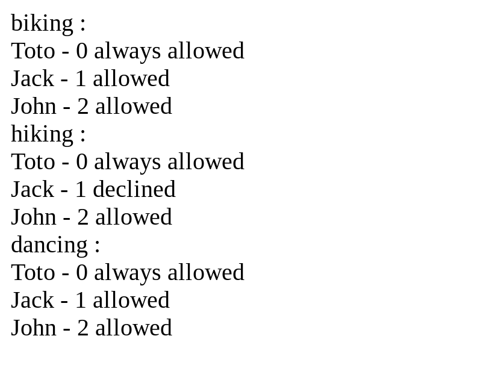

# Angular Pipes

[Angular Challenges](https://github.com/tomalaforge/angular-challenges) #8, #9, #10 - Pipes

## Screenshots

***

***

***

## Built With

- [Angular](https://angular.io)
- [Angular CLI](https://github.com/angular/angular-cli) version 16.2.0.
- [Karma Firefox Launcher](https://www.npmjs.com/package/karma-firefox-launcher)

## Directions

The goal of this series of 3 pipe challenges is to master PIPES in Angular.

Pure pipe are a very useful way to transform data from your template. The difference between calling a function and a pipe is that pure pipe are memoized. They won't be recalculated every change detection cycle if the inputs have not changed.

***

### Simple Pure Pipe

#### Information:

In this first exercice, you add calling a simple function inside your template. The goal is to convert it to a pipe.

#### Constraints:

- must be strongly typed

***

### WrapFn Pipe

#### Information

In this second exercice, you are calling multiple functions inside your template. You can create a specific pipe for each of the functions but this will be too cumbersome. The goal is to create a wrapFn pipe to wrap your callback function though a pipe. Your function MUST remain inside your component. WrapFn must be highly reusable.

***

### Utilities pipe

#### Information

In this third exercice, you want to access utils functions. Currently we cannot access them directly from your template. The goal is to create a specific pipe for this utils file where you will need to pass the name of the function you want to call and the needed arguments.

***

## Thoughts
 
- Is {pure: true} not necessary ?
- `ng generate pipe [pipeName] --skip-import` is the command to make a pipe if the app component is not a module.  
- Don't use hyphens in the name of pipes.  
- Calling a function inside a template can have a significant impact on performance as the function will be recomputed every time change detection is executed. 
- Memo functions are not as flexible as pipes. 
- Utilities pipe is more of an advanced typescript exercise. 
- The utilities pipe's approach is better than the wrapFn pipe because type safety is maintained throughout the whole process? 
- A key to making anything more typesafe is using the extends keyword.
- A more specific type extends from a generic type -> similar to overloading -> need a generic base case as a failsafe
- I was able to complete the first two pipes but I eventually gave up on the third pipe and looked at the solutions posted.  
- [This Solution](https://github.com/tomalaforge/angular-challenges/pull/20/files) reuses wrapFn logic.  However, it is a little harder to understand and has intermediate steps versus Thomas' solution.  I find using just super() in the main class a little weird.
- Thomas' solution is actually small and relies on some keywords I haven't really needed to use.  
- Parameters is a typescript utility type.  
- He added `as const` to PersonUtils to allow use of `...args`.  Without it, I think the compiler will complain because the compiler won't know how many arguments are allowed. See [Stack Overflow](https://stackoverflow.com/questions/66993264/what-does-the-as-const-mean-in-typescript-and-what-is-its-use-case) for more.  
- unknown is I don't know; any is I don't care.
- never is an empty set. unknown is a set with all possible values.  any is not a set.
- 'never' prevents defaulting to a more permissible type in conditional logic.  never will cause errors to be thrown if the value doesn't match the inferred type of First.  
- Some languages treat null as though it is a subtype of every other type, in which case it is effectively a bottom type. (This includes TypeScript if it is not configured with strict checking options.)

## Continued Development

- File structure is a mess.  I opted to comment out different solutions versus making multiple components and importing them all in another component. 
- Could have a separate pipes folder, etc.

## Useful Resources

- [Angular Docs](https://angular.io/guide/pipes-custom-data-trans) - custom pipe
- [Stack Overflow](https://stackoverflow.com/questions/56264992/how-to-convert-a-function-into-a-pipe-function) - convert a function into a pipe
- [Blog](https://kgajera.com/blog/angular-14-standalone-components/) - angular 14 standalone components
- [Stack Overflow](https://stackoverflow.com/questions/36816788/how-do-i-call-an-angular-2-pipe-with-multiple-arguments) - how do i call an angular 2 pipe with multiple arguments
- [Medium](https://medium.com/@bilalhaidar/passing-a-callback-function-into-a-custom-angular-pipe-e04e920ff355) - passing a callback function into a custom angular pipe
- [Medium](https://marklowg.medium.com/how-to-unit-test-a-custom-angular-pipe-744f20a97f5) - how to unit test a custom angular pipe
- [Bobby Hadz](https://bobbyhadz.com/blog/typescript-spread-argument-must-either-have-tuple-type) - typescript spread argument must either have tuple type
- [YouTube](https://www.youtube.com/watch?v=YE_3WwX-Dl8) - Dynamic function arguments with GENERICS - Advanced TypeScript
- [Stack Overflow](https://stackoverflow.com/questions/66993264/what-does-the-as-const-mean-in-typescript-and-what-is-its-use-case) - as const use cases
- [Stack Overflow](https://stackoverflow.com/questions/51439843/unknown-vs-any) - unknown vs any
- [Stack Overflow](https://stackoverflow.com/questions/55377365/what-does-keyof-typeof-mean-in-typescript) - keyof typeof
- [LogRocket Blog](https://blog.logrocket.com/when-to-use-never-unknown-typescript/) - when to use never and unknown
